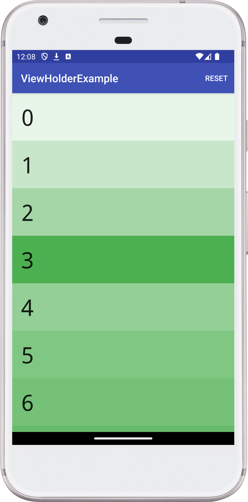

# Android RecyclerView Sample

This project demonstrates the basic usage of a RecyclerView to display a list
of items. It showcases the following:

- **Creating and setting up a RecyclerView**:
    - Defining the RecyclerView in your layout XML file.
    - Finding the RecyclerView reference in your Activity or Fragment.
    - Setting a LayoutManager (e.g., LinearLayoutManager for vertical or
      horizontal lists).
    - Creating and setting an adapter (GreenAdapter in this case).
- **Implementing a RecyclerView.Adapter**:
    - Creating a custom adapter class that extends RecyclerView.Adapter.
    - Defining a ViewHolder to hold references to the views in each list item.
    - Overriding onCreateViewHolder to inflate the item layout and create
      ViewHolder instances.
    - Overriding onBindViewHolder to populate the views in each ViewHolder with
      data.
    - Overriding getItemCount to return the total number of items in the list.
- **Handling item clicks**:
    - Defining an interface (ListItemClickListener) for click callbacks.
    - Implementing the interface in your Activity or Fragment.
    - Setting up click listeners in your ViewHolder.
    - Triggering the callback in the onClick method of your ViewHolder.
- **ViewHolder recycling and reuse**:
  The example visually demonstrates how ViewHolders are recycled by assigning
  different background colors to each ViewHolder instance. As you scroll,
  you'll see the colors get reused, illustrating the recycling mechanism.
  This sample project can be a valuable resource for developers learning to use
  RecyclerView in their Android applications.

## Contact:

For any inquiries or suggestions, please open an issue on the GitHub repository
or reach out to me directly at
[dmytro@turskyi.com](mailto:dmytro@turskyi.com).

## Screenshot:

<!--suppress CheckImageSize -->
